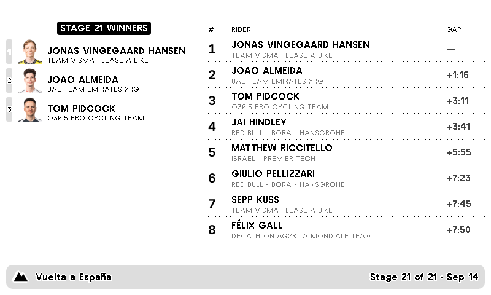

# trmnl-vuelta-classification

**Status: functional, design pass complete, pushed to TRMNL** (plugin id `443984`).

A [TRMNL](https://usetrmnl.com) private plugin (planned) that shows the current La Vuelta a España general classification and the most recent stage result. Sibling to the [`vuelta-a-espana-stages`](../vuelta-a-espana-stages) plugin, which covers today's/tomorrow's stage route and profile but not standings.



*Live preview via `trmnlp serve`, showing Stage 21 of the 2025 edition (Alalpardo → Madrid) pulled from `racecenter.lavuelta.es`.*

## How it works (intended)

Same strategy as the sibling plugin: TRMNL's polling + serverless transform. `src/transform.js` fetches from `racecenter.lavuelta.es` and returns a shaped payload the Liquid templates in `src/` render. No separate backend required.

## Local preview

Requires Docker:

```sh
./bin/trmnlp serve
```

Then open `http://localhost:4567`.

## Deploying to TRMNL

Pushed once manually — plugin id `443984` ([dashboard](https://trmnl.com/plugin_settings/443984/edit)). CI (`.github/workflows/trmnl.yml`) re-pushes on every merge to `main`, gated behind `trmnlp lint`; it needs a `TRMNL_API_KEY` repo secret to do that. Not yet added to a device playlist.

## Disclaimer

Fan-made. Not affiliated with, endorsed by, or sponsored by ASO or La Vuelta a España.
